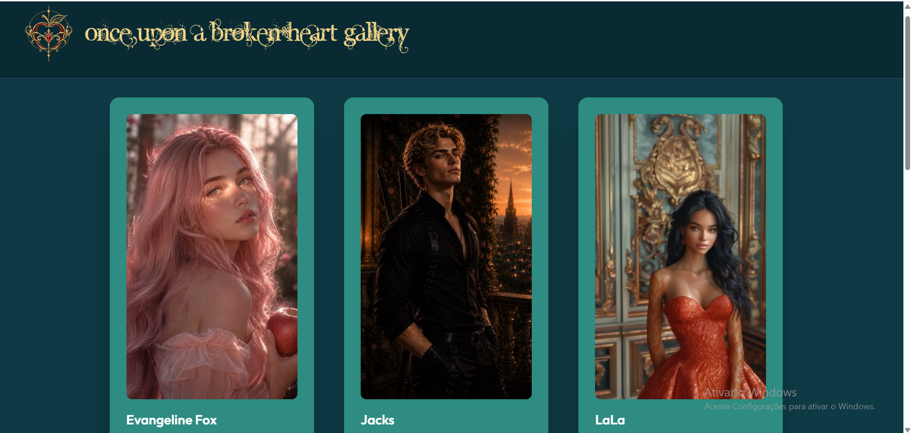
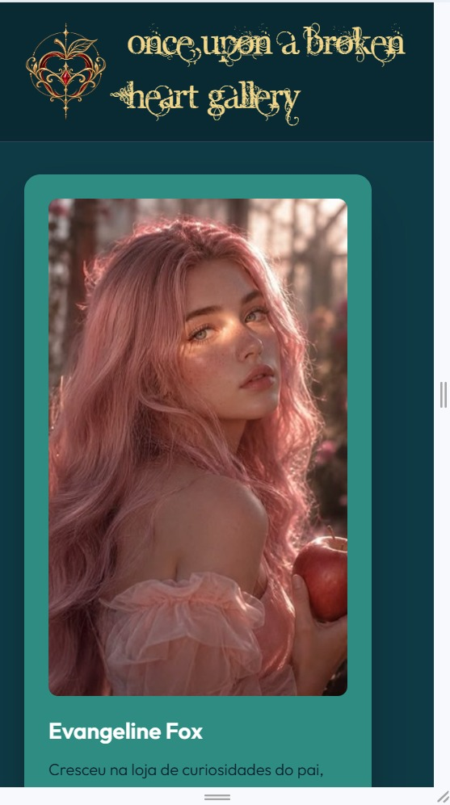

# Once Upon a Broken Heart Gallery

Uma galeria de personagens, construída com HTML e CSS puros. O projeto parte do desafio [NFT preview card component](https://www.frontendmentor.io/challenges/nft-preview-card-component-SbdUL_w0U) do Frontend Mentor e foi reimaginado com identidade visual própria: fundo azul-petróleo, detalhes dourados e uma tipografia ornamentada, inspirados na estética da saga _Once Upon a Broken Heart_.

O projeto evoluiu em três fases: um card único, uma lista de cards animada e um header com logo e identidade visual.

## Funcionalidades

- Cards de personagens com imagem, nome, descrição, dois destaques e apelido ("Conhecida como") com avatar.
- Galeria com 6 personagens diferentes, cada um com arte e informações próprias.
- Efeito de hover na arte, no título e no nome do personagem.
- Animação de entrada dos cards (Animate.css) com efeito cascata.
- Header com logo ornamentada (maçã dourada com gema rubi) e título em fonte decorativa.
- Layout responsivo para mobile, tablet e desktop.

## Identidade visual

| Elemento         | Escolha                        |
| ---------------- | ------------------------------ |
| Fundo do site    | Azul-petróleo `#0e3a45`        |
| Header           | Azul-petróleo escuro `#0a2a33` |
| Título           | Dourado suave `#f3d78a`        |
| Destaques e logo | Dourado e vinho/rubi           |
| Fonte do título  | Angelic War                    |
| Fonte do texto   | Outfit (Google Fonts)          |

## Tecnologias utilizadas

- HTML5
- CSS3 (Flexbox, Grid, `@font-face` e media queries)
- [Animate.css](https://animate.style/)
- [Outfit](https://fonts.google.com/specimen/Outfit) (Google Fonts)
- [Leonardo.ai](https://app.leonardo.ai/) (geração das imagens dos personagens, avatares e logo)
- Git e GitHub
- GitHub Pages

## Como executar localmente

```bash
git clone https://github.com/<SEU-USUARIO>/OUABH-NFT-Cards.git
cd OUABH-NFT-Cards
```

Depois, abra o arquivo `index.html` diretamente no navegador (ou use a extensão Live Server do VS Code).

## Links

- Repositório: https://github.com/<SEU-USUARIO>/OUABH-NFT-Cards
- Aplicação publicada: https://<SEU-USUARIO>.github.io/OUABH-NFT-Cards/

## Screenshots





## Créditos e avisos

- Personagens e universo inspirados na saga _Once Upon a Broken Heart_, de Stephanie Garber. Projeto sem fins comerciais, feito para estudo.
- Fonte **Angelic War**: distribuída para uso não comercial apenas.
- Imagens geradas por IA no Leonardo.ai.

## Autores

- Pessoa 1 — [@usuario1](https://github.com/manussampaio)
- Pessoa 2 — [@usuario2](https://github.com/GiBarbosaa)
